.. _lab_manual_sizing:

-------------------
Lab - Manual Sizing
-------------------

Overview
++++++++

Walkthrough a sizing exercise where you manually manipulate a rvtools export, and manually configure the Nutanix nodes.

There are times when doing a sizing for a prospect or customer is more complicated. They may have multiple locations with multiple vCenters, and there may be multiple RVTools exports. This can require you to manually manipulate the data to get the information you need.

In this lab we will use a singe RVTools that contains multiple sites and clusters. The prospect is looking to move to Nutanix, and do a datacenter consolidation.

Getting Sizing Specs from RVTool
++++++++++++++++++++++++++++++++

When you look at an RVTools export, there are few Tabs that have the information you want.

- **tabvHost** - This tab gives you information about the current hosts, number of clusters contained in the rvtools, number of VMs, and number of vCPUs.
- **tabvCPU** - This tab gives you a breakdown of the vCPUs assigned to each VM.
- **tabvMemory** - This tab gives a breakdown of memory assignment, and usage for all of the VMs.
- **tabvPartition** - This tab gives you a breakdown of assigned storage, and free|unused storage.

Calculating vCPU|Core Ratio
...........................

Lets use the **tabvHost** to calculate the number of Cores and vCPUs for each location, as well as the total of the two.

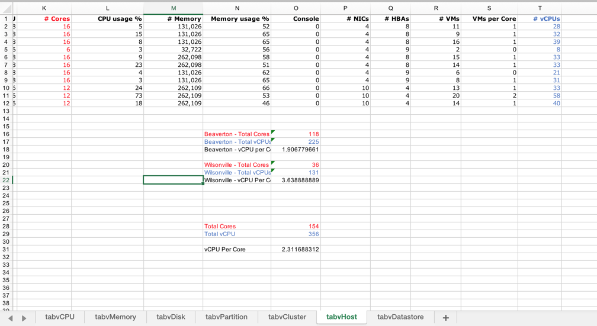

We can see the following information for each location:

- **Beaverton - Total Cores** - 118
- **Beaverton - Total vCPUs** - 225
- **Beaverton vCPU|Core Ratio** - 1.91|1

- **Wilsonville - Total Cores** - 36
- **Wilsonville - Total vCPUs** - 131
- **Wilsonville vCPU|Core Ratio** - 3.64|1

- **Total Cores** - 154
- **Total vCPUs** - 356
- **Total vCPU|Core Ratio** - 2.3|1

So looking at the two locations individually and together we could safely go with a 3|1 ratio. Taking into consideration the age of the existing server hardware and CPUs, we could also be to choose 4|1.

.. note:: We used the *=sum(cell:cell)* and *=cell/cell* formulas to get these numbers

Calculating vCPU per Cluster
............................

Lets use the **tabvCPU** to calculate the number of vCPUs for each cluster.

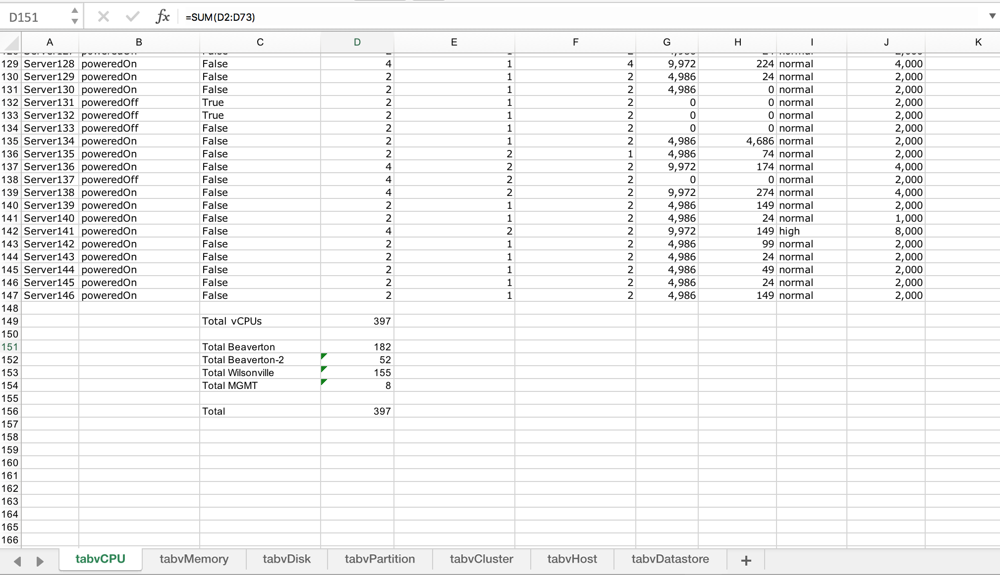

We can see the following information for each cluster:

- **Total vCPUs Cluster - Beaverton** - 182
- **Total vCPUs Cluster - Beaverton-2** - 52
- **Total vCPUs Cluster - Wilsonville** - 155
- **Total vCPUs Cluster - MGMT** - 8

.. note:: We used the *=sum(cell:cell)* formula to get these numbers

Calculating Memory
..................

Lets use the **tabvMemory** to calculate the memory for each cluster.

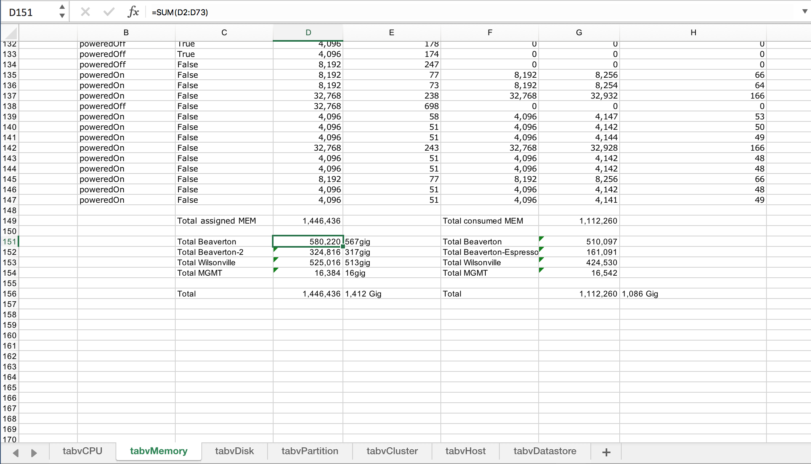

We can see the following information for each cluster:

- **Total Assigned Memory per Cluster - Beaverton** - 567gig
- **Total Assigned Memory per Cluster - Beaverton-2** - 317gig
- **Total Assigned Memory per Cluster - Wilsonville** - 513gig
- **Total Assigned Memory per Cluster - MGMT** - 16gig

.. note:: We used the *=sum(cell:cell)* formula to get these numbers

Calculating Storage
...................

Lets use the **tabvPartition** to calculate the storage for each cluster.

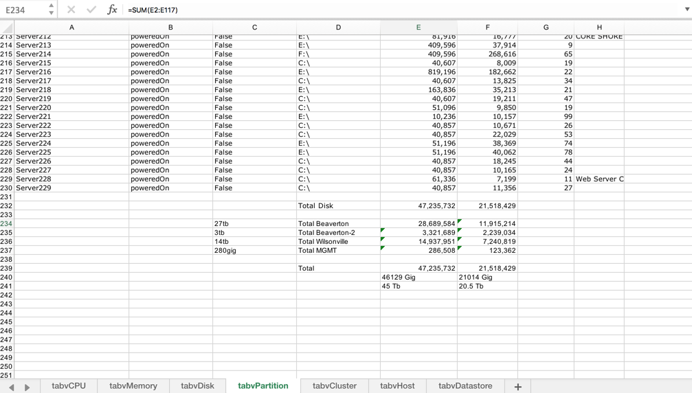

We can see the following information for each cluster:

- **Total Storage per Cluster - Beaverton** - 27tb
- **Total Storage per Cluster - Beaverton-2** - 3tb
- **Total Storage per Cluster - Wilsonville** - 14tb
- **Total Storage per Cluster - MGMT** - 280gig

.. note:: We used the *=sum(cell:cell)* formula to get these numbers

Manual Sizing
+++++++++++++

Now lets take the information we calculated above, and do our sizing.

Create the Scenario
...................

Open http://sizer.nutanix.com

Login with your **My Nutanix Login** credentials.

Click **+ Create New Scenario**, and create a demo Scenario.

Enter the following information, and click **Create**:

- **Scenario Name** - Manual Sizing Lab
- **Vendor Model** - Nutanix Models
- **Scenario Objectives**:
- **Executive Summary** - Data Center Refresh and Consolidation.
- **Requirements** - All Flash, General Server Virt. vCPU 356 / Mem 1,412gig / Storage 45tb / 3|1 vCPU|Core ratio.
- **Constraints** - Any information you have regarding Constraints.
- **Assumptions** - Any information you have regarding Assumptions.
- **Risks** - Any information you have regarding Risks.
- **Description** - Consolidating a Datacenter and a Colo into On-Prem Data Center.

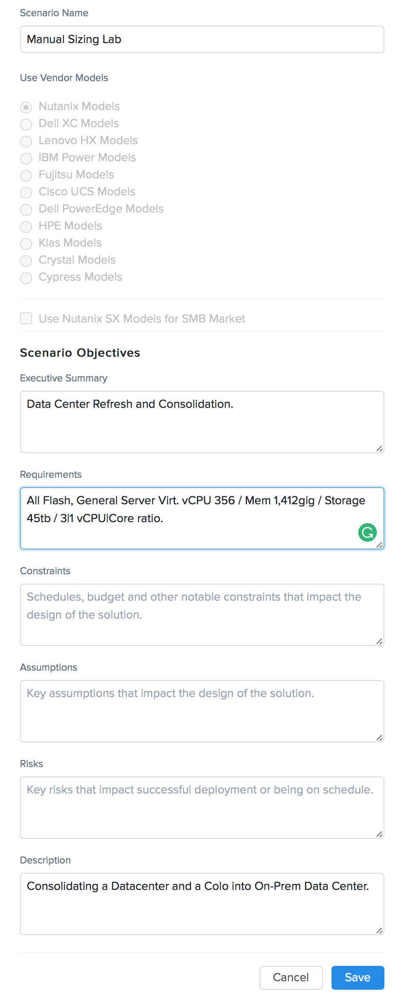

Add Workloads
.............

To highlight the current vSphere clusters and locations, we will treat the information from each cluster as a workload.

Added the Beaverton Cluster:

Click **+ Add Workload**.

Enter the following information, and click **Next**:

- **Workload Name** - Beaverton
- **Workload Type** - RAW Input

Fill out the following fields and click **Save**:

- **vCPUs** - 182
- **vCPU:pCore ratio** - 3
- **RAM** - 567
- **HDD Storage** - 0
- **SSD Storage** - 27
- **Container Replication Factor** - RF2
- **Disable Compression for Pre-Compressed Data** - No
- **Erasure Coding** - Unchecked
- **Block Awareness** - Unchecked
- **Encrypt Storage for VM** - Unchecked
- **Data Protection** - No

Added the Beaverton-2 Cluster:

Click **+ Add Workload**.

Enter the following information, and click **Next**:

- **Workload Name** - Beaverton-2
- **Workload Type** - RAW Input

Fill out the following fields and click **Save**:

- **vCPUs** - 52
- **vCPU:pCore ratio** - 3
- **RAM** - 317
- **HDD Storage** - 0
- **SSD Storage** - 3
- **Container Replication Factor** - RF2
- **Disable Compression for Pre-Compressed Data** - No
- **Erasure Coding** - Unchecked
- **Block Awareness** - Unchecked
- **Encrypt Storage for VM** - Unchecked
- **Data Protection** - No

Added the Wilsonville Cluster:

Click **+ Add Workload**.

Enter the following information, and click **Next**:

- **Workload Name** - Wilsonville
- **Workload Type** - RAW Input

Fill out the following fields and click **Save**:

- **vCPUs** - 52
- **vCPU:pCore ratio** - 3
- **RAM** - 513
- **HDD Storage** - 0
- **SSD Storage** - 14
- **Container Replication Factor** - RF2
- **Disable Compression for Pre-Compressed Data** - No
- **Erasure Coding** - Unchecked
- **Block Awareness** - Unchecked
- **Encrypt Storage for VM** - Unchecked
- **Data Protection** - No

Added the MGMT Cluster:

Click **+ Add Workload**.

Enter the following information, and click **Next**:

- **Workload Name** - MGMT
- **Workload Type** - RAW Input

Fill out the following fields and click **Save**:

- **vCPUs** - 8
- **vCPU:pCore ratio** - 3
- **RAM** - 16
- **HDD Storage** - 0
- **SSD Storage** - 1
- **Container Replication Factor** - RF2
- **Disable Compression for Pre-Compressed Data** - No
- **Erasure Coding** - Unchecked
- **Block Awareness** - Unchecked
- **Encrypt Storage for VM** - Unchecked
- **Data Protection** - No

We now have all of our workloads added.

Review Recommended Nodes
...............................

Now that we have our workloads inputed, lets review what Sizer has recommended. We see that Sizer has recommended 9 x NX-3160-G5 nodes.

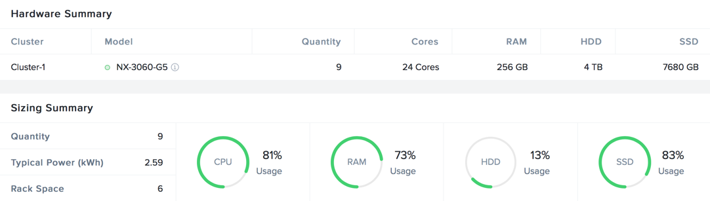

We see that our percentages for CPU usage is 81%, Memory usage is 73%, and SSD is 83% (with HDD at 13%).

Lets look at how they are configured, Click on **Modify**.

Now click **Manual**.

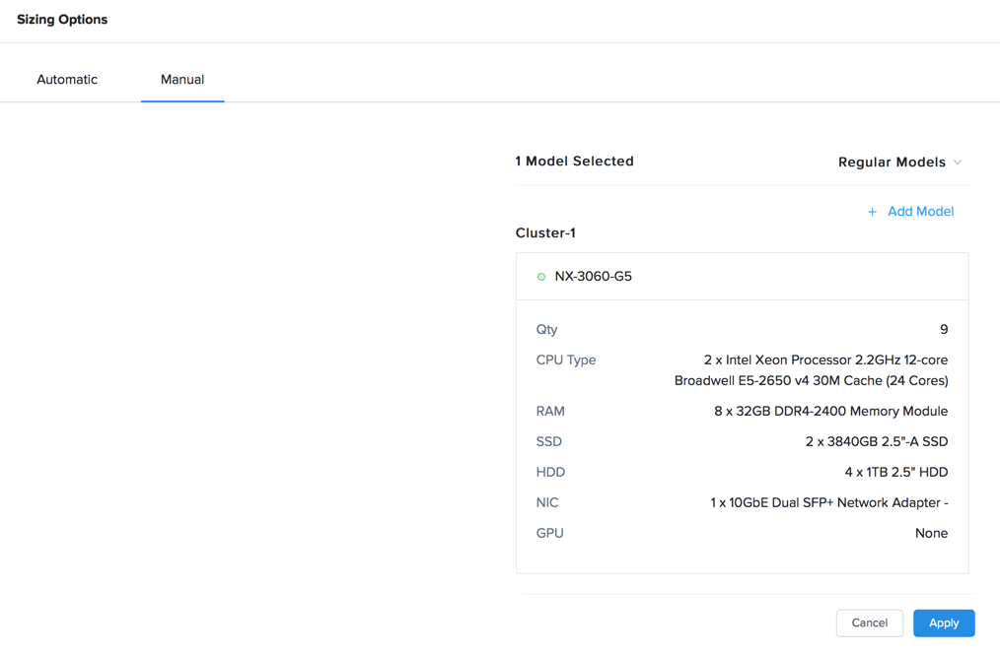

The first thing we notice is that it has suggested HDD's as part of the config. We know our prospect wants an all flash configuration.

Lets go and review the suggested config. Click **Edit** next to NX-3060-G5.

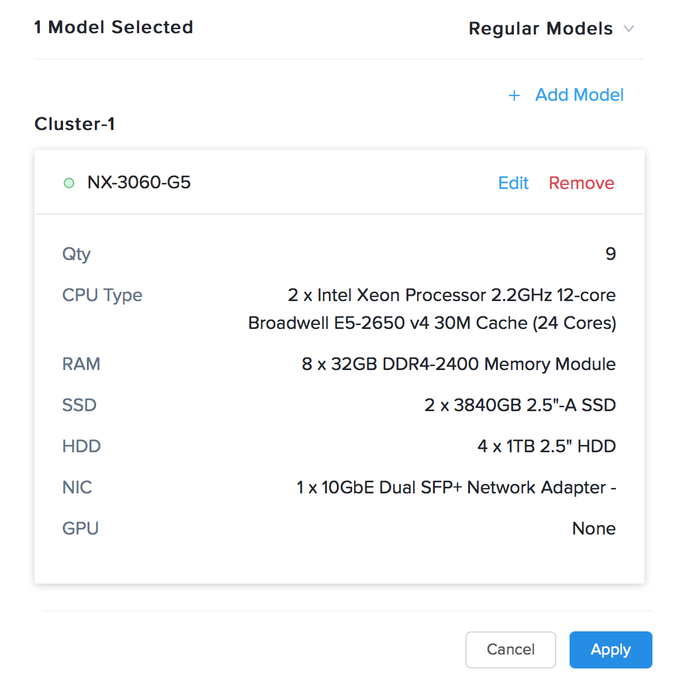

We can now manually manipulate all of the options for the nodes we select.

Let's look at our CPU options, click on the drop down for **CPU Type**.

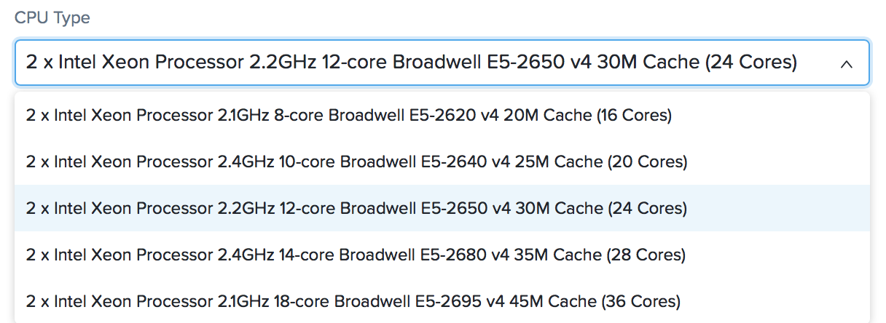

We see that Sizer has selected the CPU in the middle of the 5 CPU options for the NX-3060-G5.

Next let's look at our memory options, click on the drop down for **RAM**.

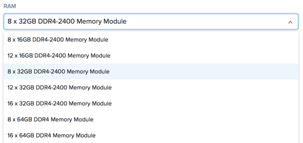

We see that Sizer has recommended 8 x 32gig Memory Modules, leaving 8 slots open (for possible upgrade later)

Next let's look at our Storage options, click on the drop down for **SSD**.

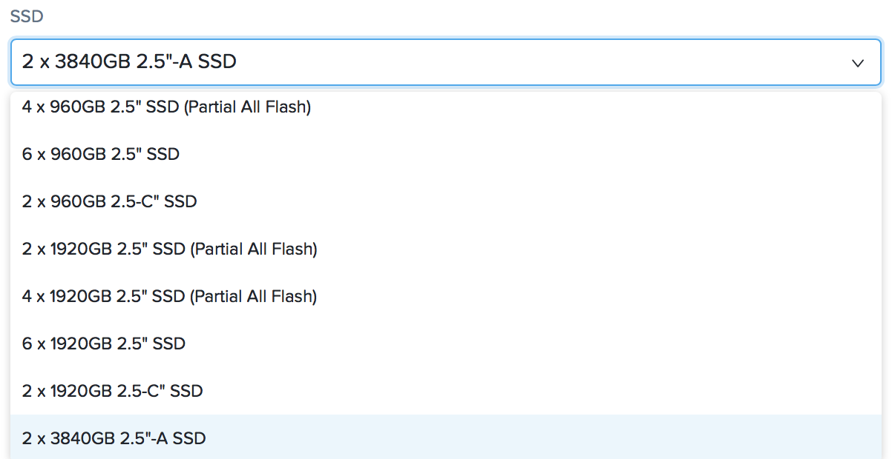

We see Sizer has has recommended 2 x 3840gig SSDs (the biggest option we offer in SSD currently).

If you click on the **HDD* drop down you will see the HDD options as well.

Sizer recommended 4 x 1tb HDDs.

Modify Recommended Nodes
........................

Now that we have reviewed all of the Sizer recommendations, lets make some manual modifications.

We know we need to do this for the Storage configuration to bring our configuration to All Flash, but what making changes to the other options. If we make changes to the CPU and Memory options, as well as the Storage, we could possibly bring the node count down. This would have a benefit to the prospect in reduced licensing costs.

Lets give our theory a try. Make the following changes, then click **Save**:

- **Quantity** - 8
- **CPU Type** - 2 x E5-2680 v4
- **RAM** - 8 x 32gig Memory Module
- **SSD** - 6 x 1920gig
- **HDD** - N/A

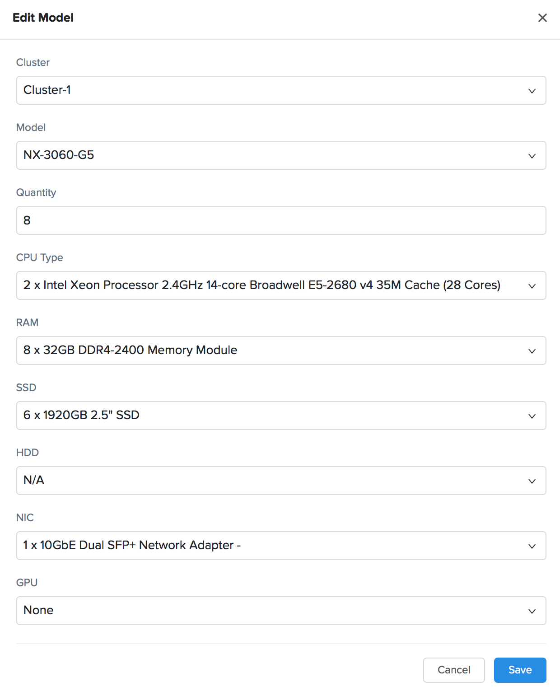

Now let's see what that has done for our usage percentages, click **Apply**.

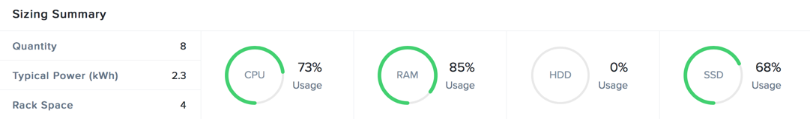

We see our percentages for CPU usage is 73%, Memory usage is 85%, and SSD is 68%. All green and room for some growth.

That looks good, but what happens when we try a different node type?

Go back in and modify the configuration using the options below, and then let's look at our usage percentages.

- **Model** - NX-8035-G6
- **Quantity** - 5
- **CPU Type** - 2 x Skylake 6140
- **RAM** - 16 x 32gig Memory Module
- **SSD** - 6 x 3.84tb
- **HDD** - N/A

Let's see what the percentages changed to.

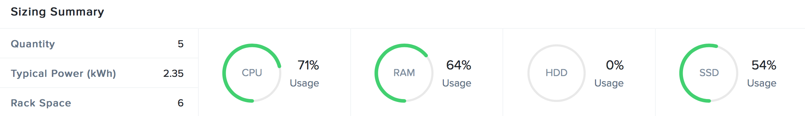

We our percentages for CPU usage is 71%, Memory usage is 64%, and SSD is 54%.

This is a great configuration for the prospect migrate to and have room for growth over the next year. We also were able to take them from 9 nodes to 5 nodes.

.. note::

  Things to consider when making manual changes.

  - Reducing the node count to much may affect N+1. Make sure you account for that.
  - You may want to prepare multiple sizing configurations to present to the prospect or customer (think Good, Better, Best)

Download the Build of Materials (BOM)
+++++++++++++++++++++++++++++++++++++

Our next step is to download the BOM for review with the Prospect or Customer.

Click the :fa:`ellipsis-v`, and then click **Download BOM**.

Ensure that all options are checked, and click **Download**.

Takeaways
+++++++++

- Sizer makes it easy to make manual changes, and review how it affects the workloads.
- Sizer gives you many options to configure a solution
- There are many solutions that may work for a prospect or customer.
