.. _sizer-intro-lab:

---------------------------
Lab - Sizer Intro/RAW Input
---------------------------

Overview
--------

In this exercise we will use data from :ref:`rvtools` and :ref:`rvtools_answers` to create a Sizer scenario and introduce you to many of Sizer's key features.

Accessing Sizer
---------------

The Nutanix Sizer tool is available to Nutanix employees and partners at http://sizer.nutanix.com

**Nutanix Employees** - Choose **Salesforce Login**

.. note:: While Nutanix employees can access Sizer via their My Nutanix credentials, accessing Sizer via Salesforce provides simplified workflows for uploading BOMs and creating quotes.

**Partners** - Choose **My Nutanix Login**

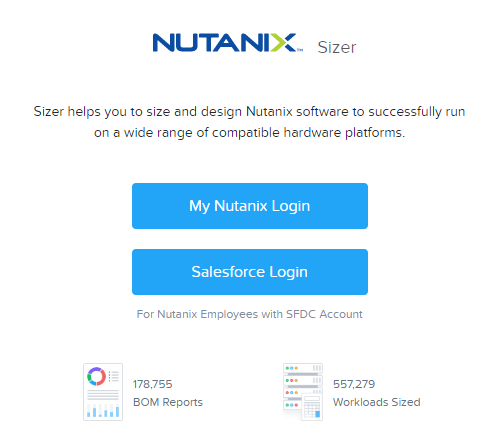

Creating a Scenario
-------------------

Once logged in, click **+ Create New Scenario**.

Provide a **Scenario Name**.

For employees, provide a **Customer Account**.

.. note::

  Customer Account and Opportunity names will auto-populate as you begin typing. Opportunity name isn't required to create the scenario, but is required later on to push the BOM to Salesforce.

Under **Use Vendor Models**, select the desired hardware platform (e.g. **Nutanix Models**).

Provide the **Executive Summary** and **Requirements**. Executive Summary should summarize the project and any problems we are seeking to address. Requirements should summarize key discovery data for sizing the workload.

.. note::

  Executive Summary and Requirements are not currently required to create the scenario, but are required prior to exporting the BOM for a scenario. All other fields are optional, but filling them out consolidates source information for a sizing scenario and is helpful when sharing or referencing old scenarios.

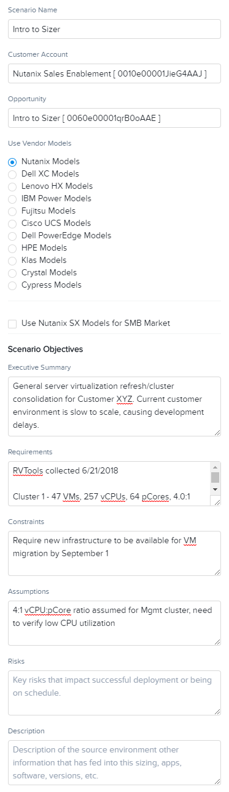

Click **Create**.

Adding Workloads
----------------

*The prospect has indicated they wish to consolidate the mixed workloads running on* **Cluster1** *and* **Mgmt** *in their current environment.*

Click **+ Add Workload**.

Specify **Cluster1** as the **Workload Name**.

.. note:: It is helpful to provide meaningful names to each workload in a scenario. Using the customer's cluster or project naming makes it easier for a customer to follow the logic behind your Nutanix sizing scenario.

Select **RAW Input** as the **Workload Type**.

.. note::

  You could also select **Server Virtualization** as a Workload Type and specify the average VM specifications, rather than the totals for RAW Input.

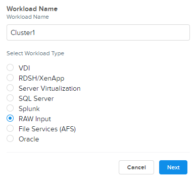

Click **Next**.

Fill out the following fields:

- **vCPUs** - 257
- **vCPU:pCore ratio** - 4
- **RAM** - 1195 GiB
- **HDD Storage** - 0
- **SSD Storage** - 18.7 TiB

.. note::

  CPU requirement can also be defined in GHz. Utilizing this input can be useful when you have historical CPU utilization from tools like Live Optics or vRealize Operations.

Under **Profile Info**, click **Customize**.

Specify **32** GiB as the **RAM Overhead per CVM**. Click **Save**.

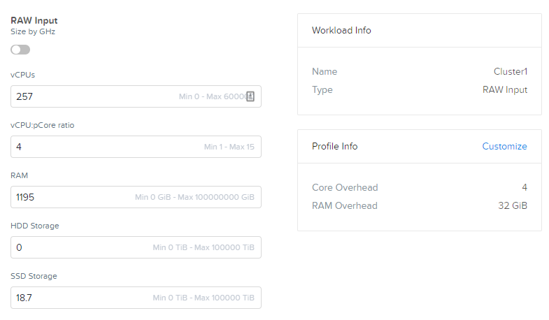

.. note::

  Refer to :ref:`ntnx` for additional information on CVM Overheads. Even if a customer is not immediately planning on using features that would require additional CVM memory (e.g. deduplication), it is generally a good idea to account for 32 GiB per CVM. A notable exception is in ROBO deployments where memory is often at a significant premium compared to storage capacity requirements.

Select your desired **Container Replication Factor**.

Select **No** for **Disable Compression for pre-compressed data**, unless your discovery of the existing environment indicates there are workloads storing pre-compressed data (images, audio, video, compressed archive files).

Leave **Container Compression**, **Deduplication**, and **Erasure Coding** at their defaults for the workload.

If required, select **Block Awareness** for the Automatic Sizer result to elect for a homogenous node configuration capable of supporting Block Awareness.

.. note::

  This does **NOT** account for additional compute and storage capacity to run all workloads in the event of an entire block (to to N + 4), it simply accounts for data availability in the event of a full block failure.

  If targeting 1N1U or 1N2U platforms, enabling Block Awareness has no impact on sizing configuration.

Under **Advanced Options**, note the ability to consolidate workloads within a single Nutanix cluster, or provide multiple clusters within a single Sizer scenario. Workloads that require dedicated clusters can also be created in separate Sizer scenarios, this is a matter of personal preference and scope of the scenario.

.. note::

  By default, the initial cluster will be named **Cluster-1**. Selecting **Create New Cluster** from the dropdown menu will allow you to create a custom name for the cluster.

If desired, select **Encrypted Storage for VM** for Sizer to select Self-Encrypting Drives (SEDs) for applicable SSDs and HDDs. Hardware-based encryption should typically only be used in high performance environments where the additional, small amount of CPU overhead from software-based encryption cannot be tolerated.

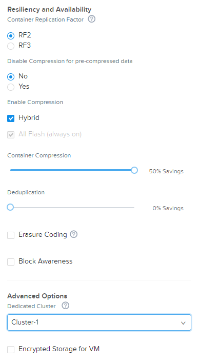

*For* **Cluster1**\ *, the prospect would like to retain the last 24 hourly snapshots and 10 daily snapshots locally. They will also require an identical remote site for DR. Based on daily incremental backup reports, the prospect estimates their daily change rate for these workloads at 2%.*

Under **Data Protection**, select **Yes**.

Select **Async** for snapshots with a maximum RPO of 60 minutes.

.. note::

  **NearSync** supports a maximum RPO of 1 minute, but currently Sizer only allows for a maximum retention of the last 15 1-minute snapshots.

Specify **2%** as the **Daily Change Rate %**.

Specify **24 Hourly Snapshots Retained** and **10 Daily Snapshots Retained**

Select **Remote Snapshot** and specify a **Cluster Name** for the remote cluster.

.. note::

  This will create a second cluster sized with minimal compute and adequate storage capacity based on the workload capacity, change rate, and retention policy. The retention policy for the remote site can be adjusted independent of the local snapshot policy.

Select **Disaster Recovery**.

.. note::

  This selection impacts the compute sizing of the remote cluster. It now needs to have enough storage capacity for the remote replication of workloads, and also enough CPU and RAM to run the workloads in the event of a cluster failure in the primary site. If not all workloads need to be restored during a site failure, this should be identified when analyzing discovery data to break up groups into those requiring remote replication and DR capabilities.

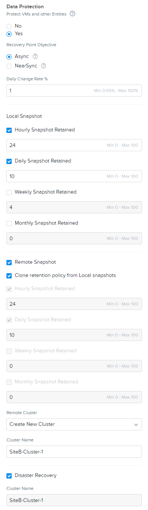

Click **Save**.

Repeat this process using the details for **Mgmt**. Under **Advanced Options**, select **Cluster-1** to indicate the workloads should be consolidated on the same Nutanix cluster as the previous workload.

*For* **Mgmt**\ *, the prospect would like to retain the last 12 hourly snapshots and 5 daily snapshots locally, but do not require remote replication or DR. Based on daily incremental backup reports, the prospect estimates their daily change rate for these workloads at 1%.*

Once completed, you will be presented with the Automatic Sizer results for **Cluster-1** and **SiteB-Cluster-1**.

.. figure:: images/7.png

.. note::

  Due to changing model/part availability, your Automatic result may not reflect the result pictured.

Customizing Automatic Sizing
----------------------------

Select **Cluster-1** from the **Summary for** drop down menu. This will update the **Sizing Summary** and **Sizing Details** for that particular cluster. Notice that the CPU utilization is slightly higher than **SiteB-Cluster-1** as it will not be a DR target for **Mgmt** cluster workloads.

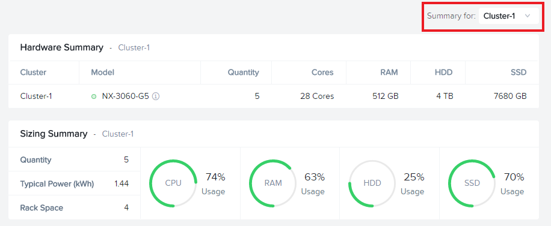

Select **Modify** from the **Sizing Options** menu.

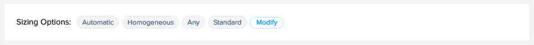

**Sizing Options** provides customizable considerations for Sizer to deliver an optimized Automatic result:

- **Cluster Type**

  - Mixed clusters will allow multiple node types within the same cluster (e.g. in a scenario with large storage capacity requirements, a mix of 3060 and 6035C nodes may be suggested).
  - Homogeneous forces all nodes within the cluster to have the same configuration.
- **Failover**

  - Aggressive does not include any additional compute/storage capacity to account for node failure.
  - Standard includes N+1 additional compute/storage capacity to account for a single node failure. Losing a node should not cause the environment to exceed defined utilization thresholds given the workload.
  - Conservative includes N+2 additional compute/storage capacity to account for two node failures. Losing up to two nodes should not cause the environment to exceed defined utilization thresholds given the workload.
- **Storage**

  - Any will choose an Automatic node configuration for the workload that may be either Hybrid or All Flash
  - All Flash will forced the Automatic node configuration to use only SSD storage.
  - Hybrid will force the Automatic node configuration to use a mix of SSD and HDD storage.

- **Model Type** - Specific models can be filtered out of Automatic results. The most common instance of this is filtering out Single Socket models in scenarios with low CPU requirements when a Single Socket node may be inappropriate (platform limitations, accounting for future growth, etc.).

- **Limit Maximum Node Count Per Cluster** - Useful when targeting a specific number of nodes for a cluster to accomodate hypervisor or other software licensing restrictions.

- **Threshold** - Default thresholds can be modified for a more conservative sizing, but should generally not be increased beyond the default values.

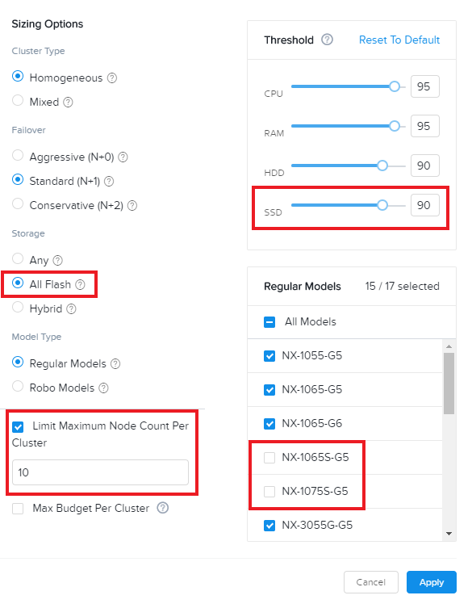

For this scenario, select **All Flash** to force an all SSD solution. Additionally, lower the **SSD Threshold** to **90**.

Click **Apply**.

Note that in the example configuration, the changes to the **Sizing Options** have altered the Automatic result. Can you spot the differences?

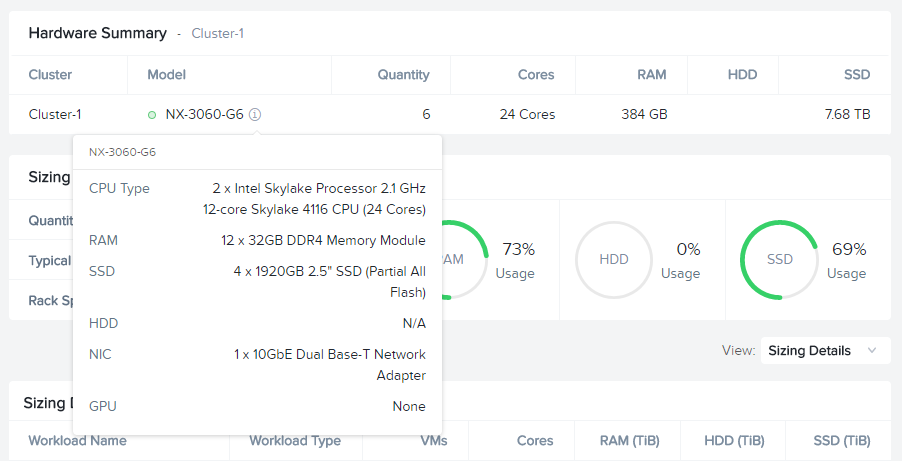

Under **View**, select **Sizing Details**.

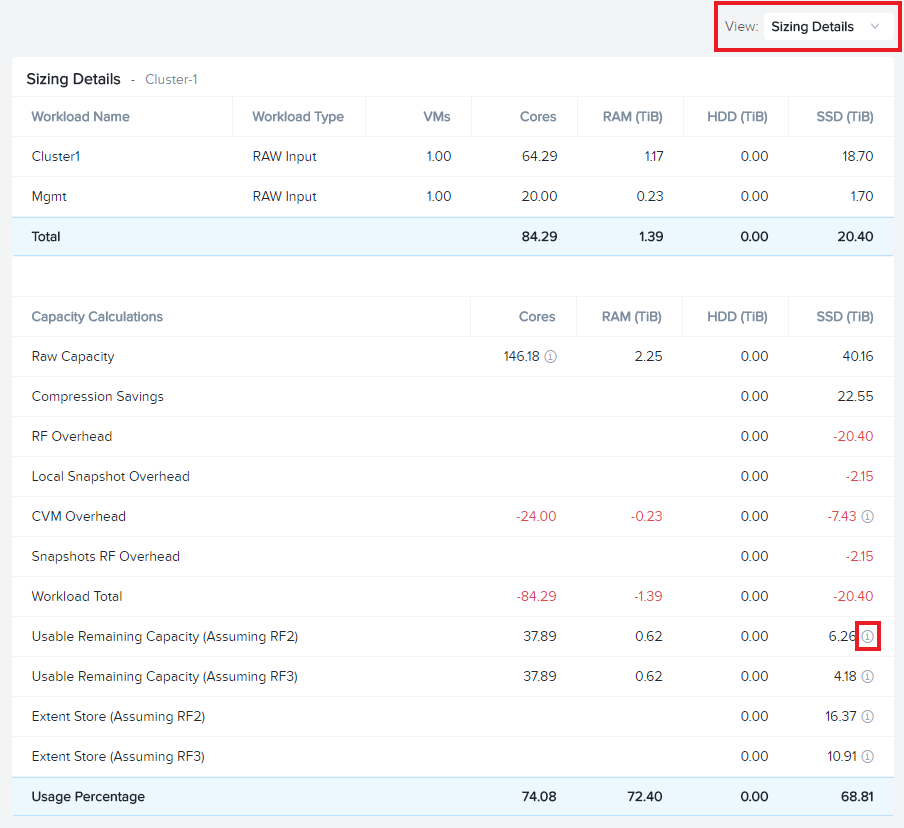

**Sizing Details** provides a breakdown of the given cluster configuration's raw capacity, the total workload requirements, space efficiency savings, and usage percentages.

Mousing over the :fa:`info-circle` icons provide additional context to the figure.

.. figure:: images/13.png

Under **View**, select **Sizing Charts > View All Charts**.

**Sizing Charts** provide a more detailed view of cluster utilization and are helpful for inclusion in proposal documents.

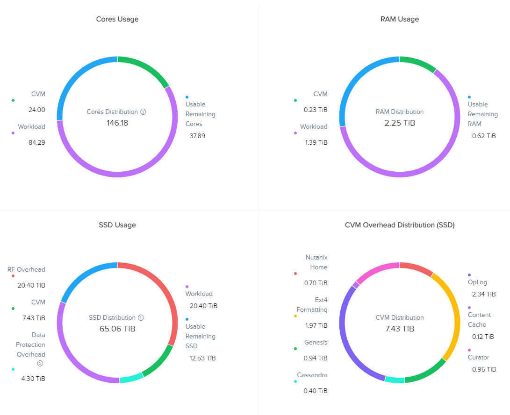

Storage Capacity Calculator
---------------------------

The Nutanix Storage Capacity Calculator is a tool within Sizer, independent of Sizer scenarios, that allows you to easily determine what the **usable** amount of storage will be for a given configuration.

In our current sizing scenario, our combined **Cluster1** and **Mgmt** workloads require 20.4 TiB of storage, *but the customer has indicated to you that they require a minimum of 40 TiB of usable storage from the cluster after 2:1 savings from compression.*

From the **Username** dropdown menu in the Sizer toolbar, select **Storage Capacity Calculator**.

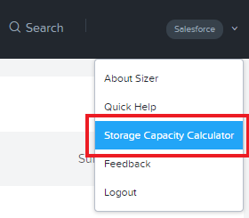

In our currently example, **Cluster-1** is 6 nodes, each with 4x 1.92TB SSDs and 0x HDDs.

In the **Storage Capacity Calculator**, fill out the following fields and click **Calculate**:

- **SSD Size** - 1920 GB
- Select **SSD is downstroked**

.. note:: Downstroking reserves an additional 80 GiB per SSD to extend the life of the SSD. Current guidance is to apply downstroking at all times unless using Self-Encrypting Drives (SEDs), which are generally higher endurance drives.

- **SSD Quantity** - 4
- **HDD Quantity** - 0
- **Replication Factor** - RF2
- **Node Count** - 5

.. note:: 5 nodes is used instead of 6 to determine what the maximum usable capacity that could be fully rebuilt in the event of a node failure.

- **Storage Efficiency** - 2:1

The Effective Capacity (RF2) is 27.3 TiB.

From here, using the Calculator effectively requires some trial and error, as well as an understanding of available drive combinations on different models. Our scenario is targeting the NX-3060-G6, which supports up to 6x SSDs.

Increase the **SSD Quantity** to **6** and press **Calculate**. The Effective Capacity (RF2) is 42.3 TiB, which meets the customer requirement without significant overprovisioning.

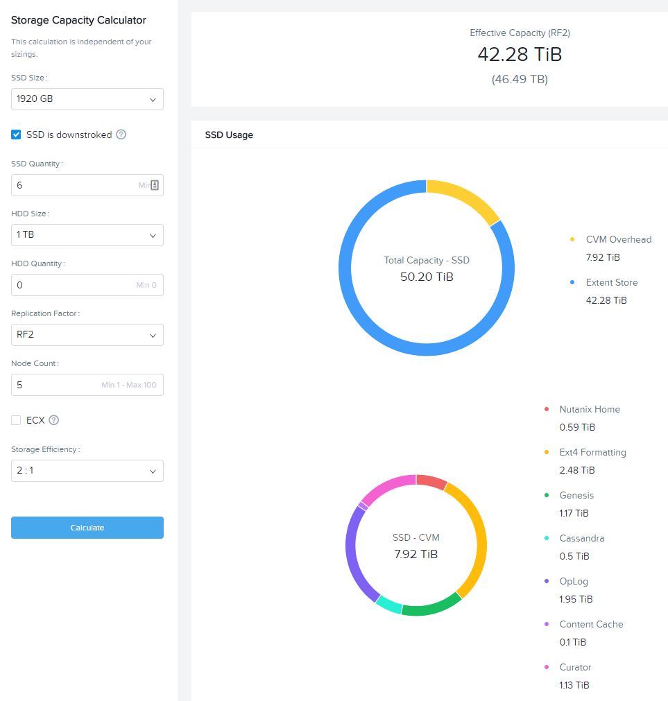

Manual Sizing
-------------

In many instances, you may want to manually configure your node configuration. Examples may include wanting to match the configuration of an existing cluster, or as in the case of this exercise, electing for an amount of storage that exceeds the immediate requirement of the workload.

Click **Sizer** in the top toolbar to return to your list of scenarios and open your test lab scenario.

Select **Modify** from the **Sizing Options** menu.

Switch from **Automatic** to **Manual**.

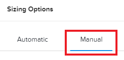

You now have complete control over node count and configuration. Mouse over **Cluster-1** and click **Edit**.

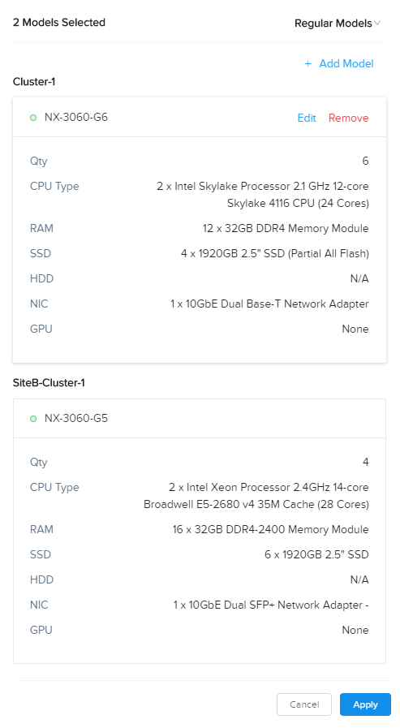

From the **Edit Model** screen, make the necessary changes to the configuration to meet the storage capacity requirement. Click **Save > Apply**.

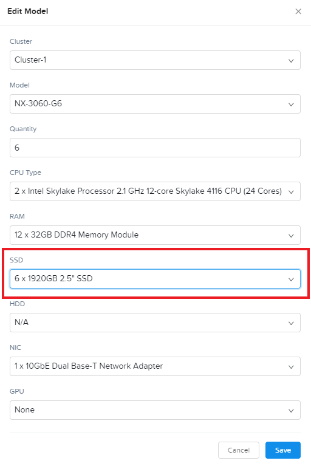

Select **Cluster-1** from the **Summary for** drop down menu and note the drop in **SSD Usage** in the **Sizing Summary**.

.. figure:: images/20.png

.. note::

  When performing a Manual sizing it is **critical** to account for compute and storage availability in the event of a node failure.

Modify the cluster to reduce the **Node Quantity** by 1 (optionally by 2 if planning for N+2 availability for an RF3 cluster). Check that all utilization values are below acceptable thresholds and then re-add the node(s) to the configuration.

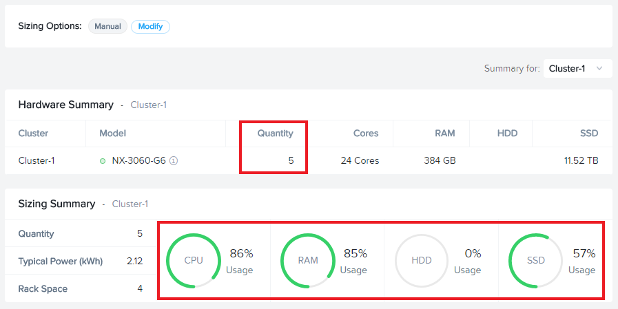

Cloning
-------

Throughout the course of a deal you may work on several different iterations of your proposed configuration, including evaluating different hardware vendors.

To clone a scenario, select the :fa:`ellipsis-v` icon located to the right of the scenario name, and select **Clone Scenario**.

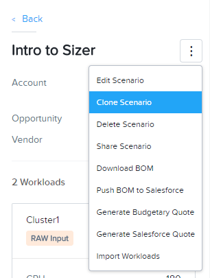

Change the **Scenario Name**, note any changes considered in this iteration in the **Scenario Objectives** fields, and if necessary, select an alternate hardware vendor.

.. note::

  Changing hardware vendors will restore **Sizing Options** to Automatic defaults, as component options may vary from vendor to vendor.

Click **Clone**.

.. note::

  After cloning your scenario you will be returned **to your original scenario**.

Sharing
-------

Sizer supports the ability to share **read-only** copies of a Sizer scenario with other Nutanix employees and partners.

To share a scenario, select the menu icon located to the right of the scenario name, and select **Share Scenario**.

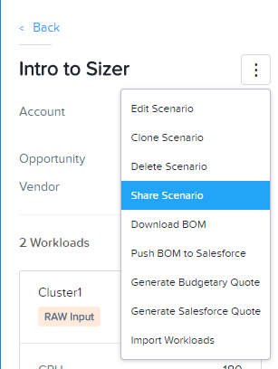

Provide the e-mail address of the user and click **Share > Done**.

.. note:: The user must already be registered in Sizer.

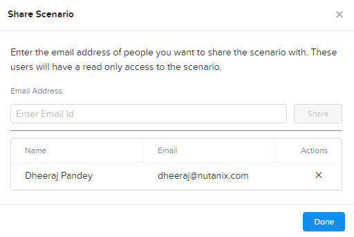

To view scenarios that have been shared with you, return to the Sizer homepage and select **Shared Scenarios**.

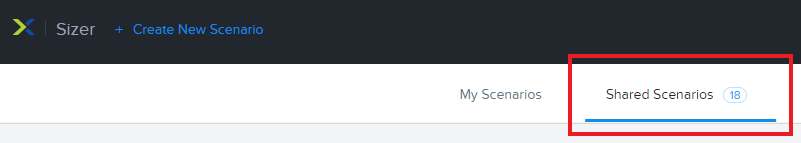

.. note::

  You will not be able to directly edit scenarios that have been shared with you, you must first clone the scenario.

BOMs
----

A Sizer BOM is an exported PDF that can contain the following details of a Sizer scenario:

- **Scenario Objectives**
- **Financial Analysis** - Based on a current IDC TCO Study comparing Nutanix NX to legacy infrastructure. *Available to Nutanix employees only*.
- **Rack View** - Nutanix NX scenarios will also include power, cooling, and weight for the proposed solution.
- **Sizing Details**
- **Recommended SKUs** - Used for building quotes. For Software Only platforms, refer to the HCL for complete configuration SKUs.

To export a BOM, select the :fa:`ellipsis-v` icon located to the right of the scenario name, and select **Download BOM**.

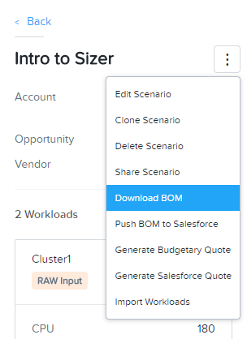

Select the desired components and click **Download**.

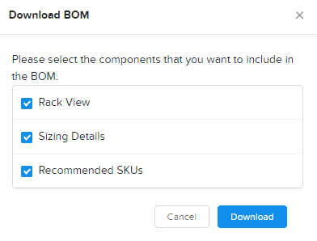

Open the PDF and familiarize yourself with the layout of the output.

For Nutanix employees, attaching the BOM to the appropriate Salesforce opportunity is a critical step in the sales cycle. To upload the BOM to Salesforce, select the :fa:`ellipsis-v` icon located to the right of the scenario name, and select **Push BOM to Salesforce**.

Specify the **Opportunity Name** and click **Push BOM**.

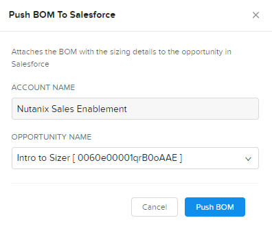

BOMs can be accessed in the **Sizer BOMs** section of each Salesforce Opportunity. Multiple BOMs can be uploaded to a single opportunity.

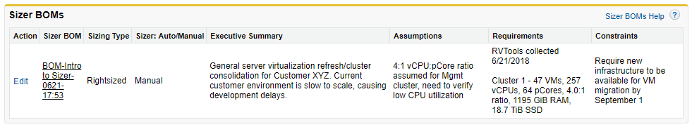
